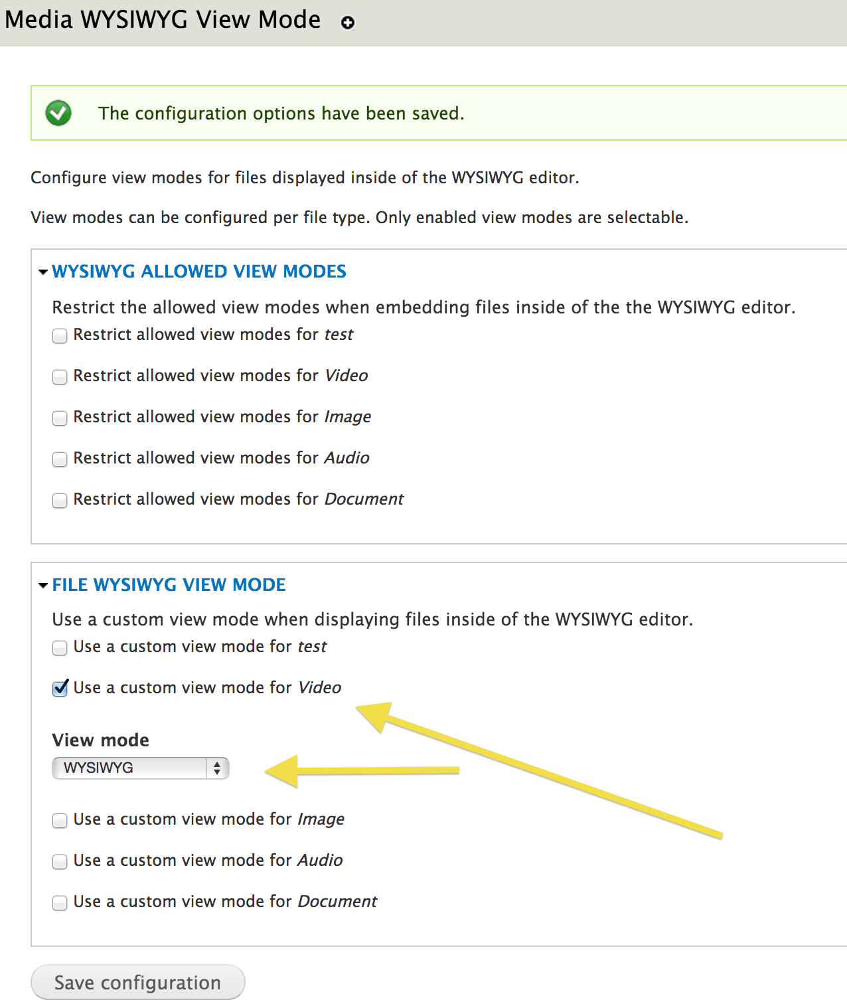
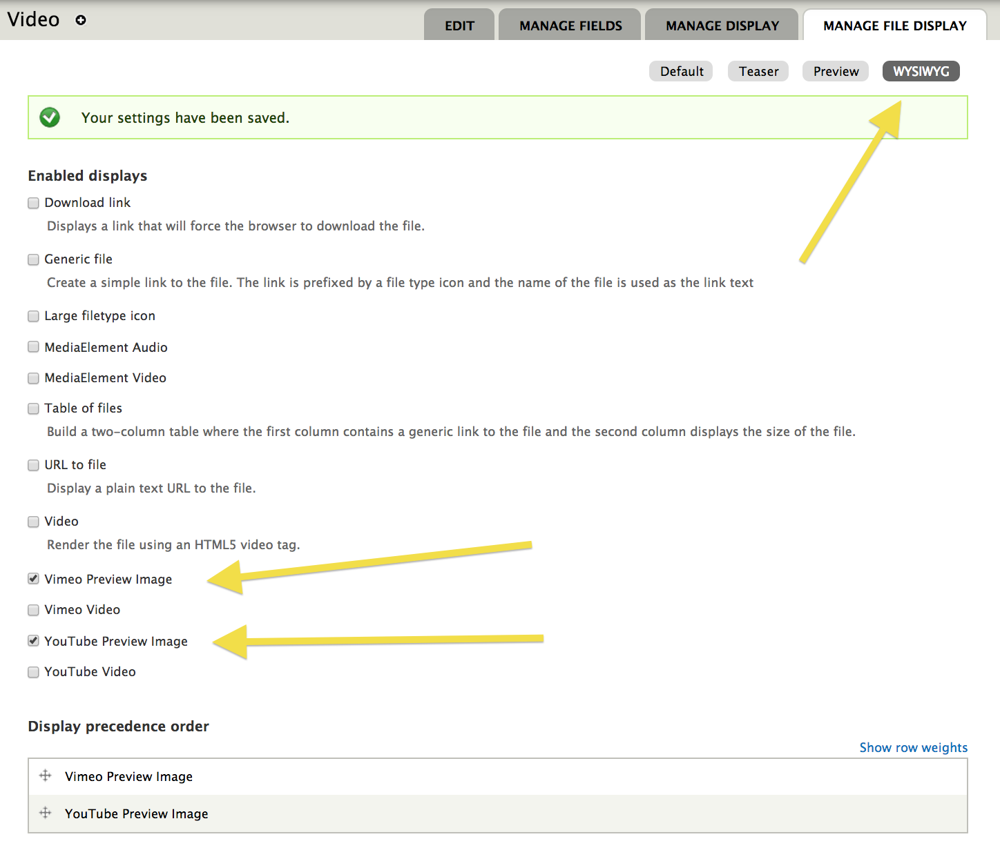

## Media

### Configuration

ImageX Media sets up a number of configurations on install, but there are others that are not easily or best handled in code and should be configured manually post-install.

#### Video Embeds

By default ImageX Media contains the "Web" tab which allows for embedding of videos in the editor. However, to get the preview in the media browser and the editor to work well you have to configure the file type display view modes.

1. Set the video file displays to contain `Video`, `Vimeo Video`, and `YouTube Video`. If you then reorder the Display precedence order so that the `Video` display is on top, the HTML5 video tag will be used in conjunction with mediaelement.js to render the video without an iframe.

    /admin/structure/file-types/manage/video/file-display

    

2. Enable the "FILE WYSIWYG VIEW MODE" in media's WYSIWYG view modes and set the view mode to the default 'WYSIWYG'.

    /admin/config/media/wysiwyg-view-mode

    

3. Return to the file type display view mode settings and configure the WYSIWYG view mode. Set the displays to use as `MediaElement Video`, `Vimeo Preview Image`, and `YouTube Preview Image`. Set the precedence to put `MediaElement Video` on top, unless you prefer the preview images are used instead of the video player.

    /admin/structure/file-types/manage/video/file-display/wysiwyg

    

The end result will be the ability to have fully function video embeds in the media browser preview and on the frontend, along with a non-functioning video editor shell embedded in the WYSIWYG editor. The editor's video player isn't functional because the editor is inside an iframe and doesn't have mediaelement.js.

- **Media browser preview**

    

- **Editor**

    

- **Frontend**

    
